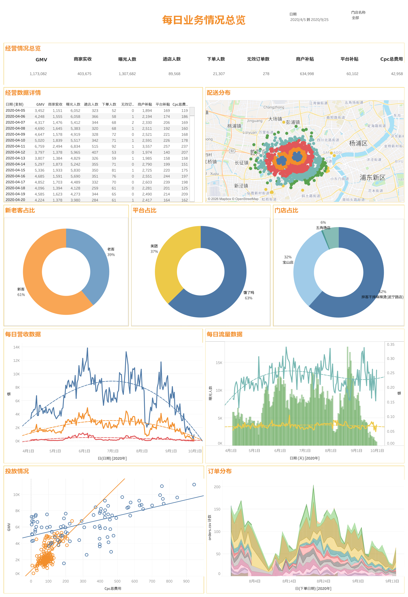

# 外卖平台门店经营分析仪表盘

基于 11 家连锁餐饮门店的**平台经营数据、广告投放数据与订单明细**，用 Tableau 搭建的一套经营分析仪表盘，
覆盖流量转化、渠道对比、投放效果、订单分布与配送分布五个分析维度。

仪表板名称：**每日业务情况总览**



> 上图为仪表板完整视图（筛选区间 2020-04-05 至 2020-09-25）。Tableau 在线交互预览链接待补充。

---

## 项目概览

| 项目 | 说明 |
| :--- | :--- |
| 分析对象 | 上海地区 11 家连锁餐饮门店（2 个品牌），覆盖美团、饿了么双平台 |
| 数据周期 | 门店经营与投放 2019-08-21 至 2020-09-25；订单明细 2020-07-28 至 2020-09-14 |
| 数据规模 | 门店经营 2,385 条 / 广告投放 1,177 条 / 订单明细 4,419 条 |
| 全周期核心指标 | GMV 286.5 万，有效订单 50,973 单，广告投放 15.25 万元 |
| 工具 | Tableau Desktop 2026.2（twb / twbx），数据源为三表关联的 federated 连接 |

> **关于两套口径**：上表为全周期（2019-08-21 起）汇总；README 中"主要分析发现"各节若未特别说明，
> 亦为全周期口径。而上方仪表板截图受日期筛选器限制，展示的是 **2020-04-05 至 2020-09-25** 区间：
> GMV 117.3 万、曝光 130.8 万、进店 8.96 万、下单 2.13 万。两套数据均已与原始 CSV 逐项核对一致。

---

## 目录结构

```
.
├── README.md
├── data/
│   ├── shop.csv        门店日粒度经营数据（2,385 条）
│   ├── cpc.csv         广告投放与 ROI 数据（1,177 条）
│   └── orders.csv      订单明细（4,419 条）
├── workbook/
│   ├── takeout-operations-dashboard.twb    Tableau 工作簿（XML，不含数据）
│   └── takeout-operations-dashboard.twbx   Tableau 打包工作簿（含数据，可直接打开）
└── screenshots/
    └── 01-dashboard-overview.png           仪表板完整视图
```

> 打开方式：用 Tableau Desktop / Tableau Reader 直接打开 `workbook/takeout-operations-dashboard.twbx`，
> 数据已打包在内，无需额外配置数据源。若使用 `.twb`，需将 `data/` 下三个 CSV 放在同一目录并重新指向数据源。
>
> 注意：三个 CSV 为 **GBK 编码**，导入 Tableau 时需在数据源中指定编码，否则中文列名会乱码。

---

## 数据说明

### shop.csv —— 门店日粒度经营数据

| 字段 | 含义 |
| :--- | :--- |
| 品牌ID / 品牌名称 / 城市 / 平台 / 日期 / 门店ID / 门店名称 | 维度 |
| GMV | 成交总额 |
| 下单人数 | 当日下单用户数 |
| 商家实收 | 商家实际到账金额 |
| 商户补贴 / 平台补贴 | 商家侧与平台侧补贴金额 |
| 曝光人数 / 进店人数 | 流量漏斗上两层 |
| 有效订单数 / 无效订单数 | 订单质量分层 |

### cpc.csv —— 广告投放数据

| 字段 | 含义 |
| :--- | :--- |
| cpc单次点击费用 / cpc总费用 | 投放成本 |
| cpc曝光量 / cpc访问量 | 付费流量 |
| 自然曝光量 / 自然访问量 | 免费流量 |
| gmvroi / 实收roi | 投入产出比 |
| 门店下单量 / 门店营业额 / 门店实收 | 投放结果 |
| 下单转换率 / 单均gmv / 单均实收 | 效率指标 |

### orders.csv —— 订单明细

| 字段 | 含义 |
| :--- | :--- |
| 下单日期 / 下单时间 / 下单日期时间 | 时间维度 |
| 用户id / 订单id / 订单状态 | 标识与状态 |
| 配送地址eleme / 配送坐标 / 纬度 / 经度 / 距离 | 地理维度 |
| order_7d / 15d / 30d / 60d / 90d | 用户历史下单次数（用于新老客判定）|
| 订单金额 / 用户实付 / 商家实收 / 总补贴 | 金额拆解 |
| 配送费 / 餐盒费 / 服务费 / 菜品个数 / 配送类型 | 成本与订单结构 |

---

## 分析方法与计算字段

### 1. 流量漏斗三率

将曝光、进店、下单三层串联为完整漏斗，用计算字段量化各层转化效率：

```
进店率 = SUM([进店人数]) / SUM([曝光人数])
成交率 = SUM([下单人数]) / SUM([进店人数])
```

### 2. 新老客判定

以用户近 90 天历史下单次数为判定依据，将订单划分为新客与老客：

```
新老客 = IF IFNULL([order_90d], 0) = 0 THEN '新客' ELSE '老客' END
```

使用了 `IFNULL` 处理缺失值——数据中 `order_90d` 存在空值，若直接比较会因空值传播导致判定失败。

### 3. 占比类指标的表计算

饼图占比使用表计算而非固定分母，使其能随筛选器动态重算：

```
占比 = SUM([订单数]) / TOTAL(SUM([订单数]))
```

### 4. 多表关联主键

门店经营表与订单表缺少天然唯一键，通过拼接构造复合主键完成关联：

```
主键 = [订单id] + [配送地址eleme] + [下单日期时间 (复制)]
```

### 5. 日期处理

原始日期为字符串格式，通过以下字段转换为可用于时间序列的日期类型：

```
[日期 (天)] = DATE(DATETRUNC('day', [日期]))
[日期 (复制)] = STR([日期])
```

---

## 可视化设计

仪表板由 10 个工作表组成，全部受**日期、平台、门店名称**三个筛选器联动控制。

| 工作表 | 图表类型 | 分析目的 |
| :--- | :--- | :--- |
| 经营情况总览 | KPI 指标卡（7 个） | 核心指标的集中呈现：GMV、商家实收、曝光人数、进店人数、下单人数、无效订单数、商户补贴、平台补贴、Cpc 总费用 |
| 经营数据详情 | 交叉表 | 按日期的明细下钻，含 GMV、实收、曝光、进店、下单、无效订单、商户/平台补贴、Cpc 费用 |
| 平台占比 | 环形饼图 | 美团与饿了么的营收结构对比（美团 37% / 饿了么 63%）|
| 门店占比 | 环形饼图 | 各门店营收贡献结构（宝山店 26% / 五角场店 22% / 其他门店合计）|
| 新老客占比 | 环形饼图 | 客户结构健康度（新客 61% / 老客 39%）|
| 每日营收数据 | 折线图（多测度） | GMV 与实收的日度走势，含趋势线 |
| 每日流量数据 | 柱状 + 折线组合（双轴） | 曝光/进店/下单的量级对比与转化率走势 |
| 投放情况 | 散点图 | Cpc 总费用与 GMV 的投入产出关系，含趋势线 |
| 配送分布 | 地图（热力 + 符号） | 基于经纬度的订单地理分布，可看出订单集中在外环内 |
| 订单分布 | 面积图（堆叠） | 订单量按日期的构成与波动 |

设计上采用**总览 + 明细**的分层结构：顶部 KPI 卡片给出概览结论，中部饼图与交叉表支撑结构拆解，
底部趋势图、散点图与地图支撑归因分析。统一的日期 / 平台 / 门店筛选器使四层视图能在同一条件下联动查看。

---

## 主要分析发现

### 发现一：转化漏斗的瓶颈在进店环节

| 漏斗层级 | 人数 | 层间转化率 |
| :--- | ---: | ---: |
| 曝光 | 3,238,657 | — |
| 进店 | 257,519 | **7.95%** |
| 下单 | 49,445 | **19.20%** |

曝光到进店仅 7.95%，意味着超过 92% 的曝光未能转化为店铺访问；
而进店后的成交率达到 19.20%，说明**店铺页的承接能力并不差，问题出在曝光素材与列表页竞争力**。
这一结论将优化方向从"提升店铺转化"转向"优化曝光入口"，两者的投入产出完全不同。

### 发现二：补贴金额超过商家实际营收

| 指标 | 金额 | 占 GMV |
| :--- | ---: | ---: |
| GMV | 2,865,330 | 100% |
| 商家实收 | 1,032,409 | 36.0% |
| 商户补贴 | 1,519,475 | **53.0%** |
| 平台补贴 | 174,106 | 6.1% |

商户补贴占 GMV 高达 53%，是商家实收（36.0%）的 1.47 倍，两者差额被补贴覆盖。
这意味着**该品牌当前的 GMV 增长高度依赖补贴驱动**，账面 GMV 与实际到手收入存在显著落差。
若补贴退坡，GMV 的可持续性需要重新评估。这是本次分析中最需要管理层关注的结论。

### 发现三：付费流量贡献过半曝光，但获客成本极低

| 指标 | 数值 |
| :--- | ---: |
| 付费曝光 / 自然曝光 | 1,590,111 / 1,450,790 |
| 付费曝光占比 | **52.29%** |
| 广告总费用 | 152,516 元 |
| 整体 ROI（营业额 / 广告费） | **17.60** |
| 单均获客成本 | **3.20 元** |
| 广告点击率 CTR | 6.76% |
| 广告访问到下单率 | 44.33% |

付费曝光已超过自然曝光，说明流量结构对投放的依赖度较高。
但另一方面，17.60 的整体 ROI 与 3.20 元的单均获客成本处于相当健康的水平，
且广告访问到下单率高达 44.33%——**投放带来的流量精准度高于自然流量**。
因此当前策略不应削减投放，而应关注如何把付费流量沉淀为复购。

### 发现四：客户结构以新客为主，复购基础薄弱

订单明细中 4,419 单来自 2,903 名用户，其中：

| 客户类型 | 订单数 | 占比 |
| :--- | ---: | ---: |
| 新客（近 90 天无历史下单）| 2,687 | **60.8%** |
| 老客 | 1,732 | 39.2% |

新客订单占比超过六成。结合发现三中较低的获客成本，
可以判断品牌正处于**以投放拉动拉新的扩张阶段**，而老客复购尚未形成稳定贡献。
后续应重点观察新客的二次转化率，否则将陷入"持续买量"的循环。

### 发现五：营收高度集中于头部门店

| 门店 | GMV | 占比 |
| :--- | ---: | ---: |
| 宝山店 | 756,838 | 26.4% |
| 拌客干拌麻辣烫（武宁路店）| 722,334 | 25.2% |
| 五角场店 | 629,745 | 22.0% |
| 虹口足球场店 | 361,025 | 12.6% |
| 其余 7 家合计 | 395,388 | 13.8% |

前三家门店贡献了 **73.6%** 的 GMV，而尾部门店表现极弱（交大店仅 2,498 元，大世界店为 0）。
这种极端集中意味着整体指标受头部门店主导，**看整体数据容易掩盖单店问题**，
因此仪表板中保留了门店维度筛选器，用于单店诊断。

### 发现六：订单时段与配送半径特征

- **下单高峰**：11 时（1,252 单）、12 时（512 单）、10 时（428 单）——**午餐时段占据绝对主导**，
  11 时单小时订单量是晚高峰（19 时）的 3.8 倍，产能与配送调度应向午市倾斜
- **配送距离**：均值 1,513 米、中位 1,388 米、最远 4,604 米，配送半径集中，
  具备按距离分层设计配送费与起送价的空间

---

## 数据质量与处理说明

分析过程中发现并处理了以下数据问题：

1. **CSV 编码为 GBK**，直接按 UTF-8 导入会导致中文列名乱码，需在数据源中显式指定编码
2. **缺失值处理**：`order_90d` 等历史订单字段存在空值，新老客判定中使用 `IFNULL` 兜底，
   避免空值传播导致判定为 NULL
3. **主键缺失**：门店经营表与订单表无天然唯一键，通过拼接订单 ID、配送地址与下单时间构造复合主键
4. **多品牌混表**：`shop.csv` 中同时包含两个品牌（蛙小辣火锅杯、拌客），
   分析时通过品牌与门店筛选器隔离，避免口径混淆

---

## 复现步骤

1. 将 `data/` 下三个 CSV 放入同一目录
2. 用 Tableau Desktop 打开 `workbook/takeout-operations-dashboard.twbx`（已打包数据，可跳过步骤 1、3）
3. 若使用 `.twb`：新建数据源 → 文本文件 → 依次导入三个 CSV，
   编码选择 **GBK** → 按「主键」关联三表 → 即可还原全部工作表

---

## 项目收获

- **指标体系搭建能力**：从原始字段出发构建曝光—进店—下单的完整流量漏斗，
  并补充 ROI、获客成本、补贴率等经营效率指标
- **Tableau 技能**：熟练使用计算字段、表计算（`TOTAL`）、`IFNULL` 空值处理、
  `DATETRUNC` 日期函数、多表关联与复合主键、筛选器联动、地图可视化
- **图表选型判断**：按分析目的选择图表——占比用饼图、趋势用折线、
  投入产出关系用散点图、地理分布用地图、明细下钻用交叉表
- **业务洞察能力**：不停留在"把图画出来"，而是从数据中得出可行动的结论
  （如识别出补贴依赖、漏斗瓶颈在曝光层、营收集中度风险）
- **数据质量意识**：处理了编码、缺失值、主键缺失、多主体混表四类典型数据问题
